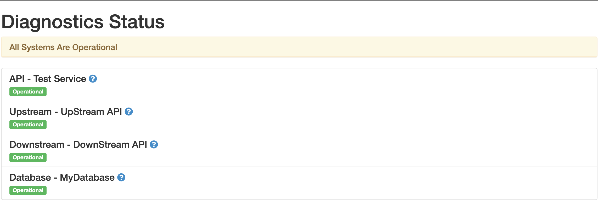

# Diagnostics Endpoint

Library to generate diagnostics endpoint for flask based python web applications.

## Installation 

### Installation from PyPi

this package can be installed from PyPi using pip :

```bash
pip install -U diagnostics-endpoint
```

### Installation from Github
Install this package directly from github:

```python
pip install -U git+ssh://git@github.com/shardulsrivastava/python-diagnostics.git@master
```

## Usage

1. Add the dependency in requirements.txt.
```bash
diagnostics-endpoint==0.0.7
```

2. Add the below line to your application entry point:
```python
from diagnostics_endpoint import Diagnostics

application_endpoints = [
    {"name": "API - Test Service", "endpoint": "http://my-api"},
    {"name": "Upstream - UpStream API", "endpoint": "https://my-upstream-api"},
    {"name": "Downstream - DownStream API", "endpoint": "https://my-downstream-api"},
    {"name": "Database - MyDatabase", "endpoint": "tcp://my-database-host:my-database-port"}
]

app = Flask(__name__)
Diagnostics.render(app, application_endpoints)

```

This will generate two endpoints :
 1. `/diagnostics` as
  
  


 2. `/heartbeat` with response as `Ok`

## Configuration

`diagnostics-endpoints` supports configuration via `Diagnostics.render()` method.

## Set Application Endpoints
`Diagnostics.render()` method takes a list of dictionaries of application endpoints. Format of the dictionary is :
```python
application_endpoints = [{"name": "API Name","endpoint": "API URL"}]
```

here endpoint can be a `http`, `https` or `tcp` endpoint. You can also give absolute URLs as well by giving the url directly as `/user`.
Example:
```python
application_endpoints = [
                            {"name": "My API Endpoint","endpoint": "/hello"},
                            {"name":"My HTTP Endpoint","endpoint":"http://example.com/healthcheck"},
                            {"name":"My HTTPS Endpoint","endpoint":"https://example.com/healthcheck"},
                            {"name":"My TCP Database Endpoint","endpoint":"tcp://my-database-host:3306"}    
                        ]
```


### Set Application Root
you can specify application root path as:

```python
Diagnostics.render(app, application_endpoints, "/myapplication")
```

This will generate the two endpoints as `/myapplication/diagnostics` and `/myapplication/heartbeat`.
