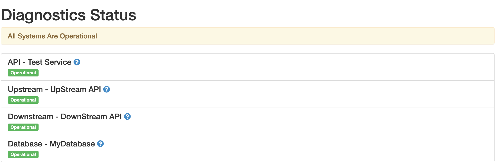

# python-diagnostics

Library to generate diagnostic endpoint for flask based python web applications.

## Installation 

### Installation from PyPi

this package can be installed from PyPi using pip :

```bash
pip install -U diagnostics-endpoint
```

### Installation from Github
Install this package directly from github:

```python
pip install -U git+ssh://git@github.com:shardulsrivastava/python-diagnostics.git@master
```

## Usage

1. Add the dependency in requirements.txt.
```bash
diagnostics-endpoint==0.0.5
```

2. Add the below line to your application entry point:
```python
from diagnostics_endpoint import Diagnostics

application_endpoints = [
    {"name": "API - Test Service", "endpoint": "http://my-api"},
    {"name": "Upstream - UpStream API", "endpoint": "https://my-upstream-api"},
    {"name": "Downstream - DownStream API", "endpoint": "https://my-downstream-api"},
    {"name": "Database - MyDatabase", "endpoint": "tcp://my-database-host:my-database-port"}
]

app = Flask(__name__)
Diagnostics.render(app, application_endpoints)

```

This will generate a two endpoints :
 1. `/diagnostics` as
  
  


 2. '/heartbeat' with response as `Ok`

